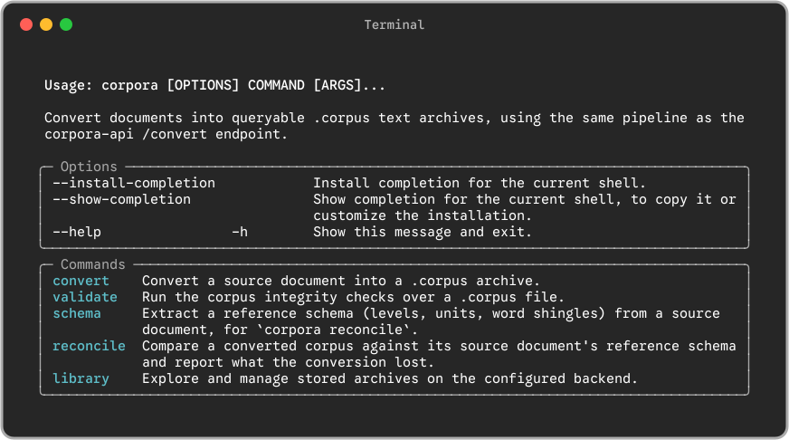
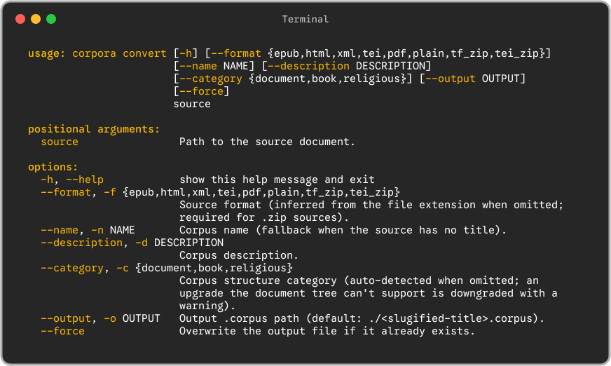
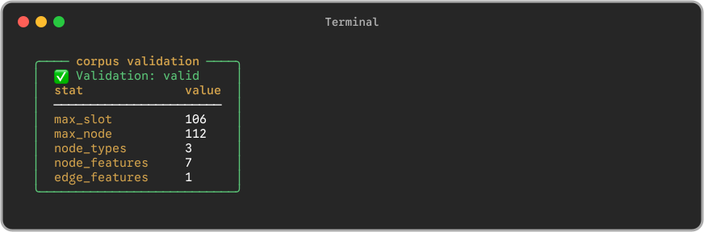
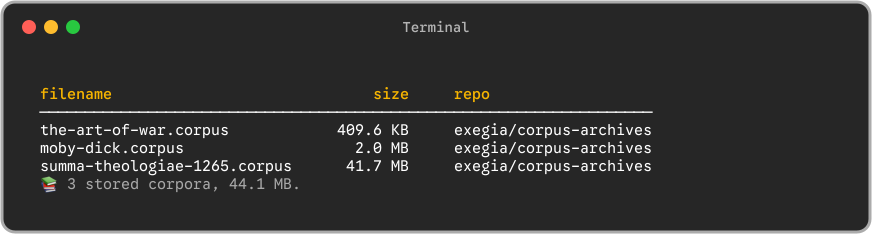
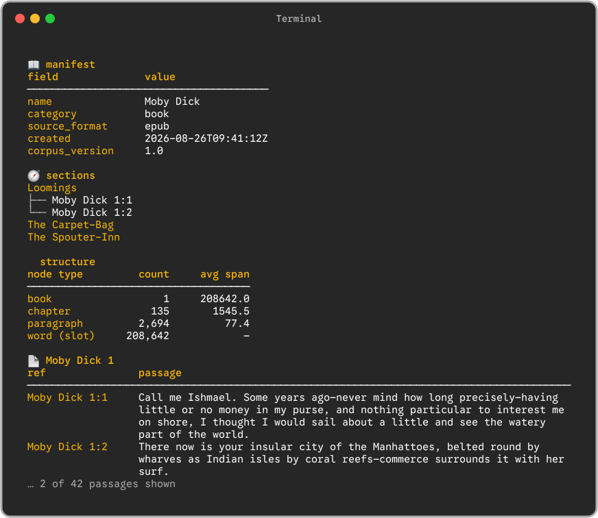

<p align="center">
  
</p>

# corpora/cli

<p align="center">
  Convert EPUBs, PDFs, HTML, TEI/XML, and plain text into queryable
  <code>.corpus</code> archives — from your terminal.
</p>

<p align="center">
  <a href="LICENSE"></a>
  
</p>

<p align="center">
  
</p>

`corpora` is the terminal front end for the
[corpora-py](https://github.com/exegia/corpora-py) toolchain: it parses a
source document, builds a [Text-Fabric](https://annotation.github.io/text-fabric/)
dataset from it, and packages the result as a single portable `.corpus`
archive that the rest of the toolchain (API, MCP server, storage backends)
can query.

## Installation

Install with [Homebrew](https://brew.sh) — one command, no separate tap step:
Homebrew taps [`exegia/corpora`](https://github.com/exegia/homebrew-corpora)
on the way in.

```bash
brew install exegia/corpora/cli
```

This builds the CLI into its own virtualenv (Python 3.13, resolved from PyPI)
and links three commands:

| Command       | What it does                                                              |
| ------------- | ------------------------------------------------------------------------- |
| `corpora`     | Conversion, validation and library CLI                                    |
| `corpora-api` | Combined FastAPI app (conversion API at `/convert`, MCP server at `/mcp`) |
| `cf-mcp`      | Standalone MCP server (stdio) for AI clients                              |

Verify the install:

```bash
corpora --help
```



Upgrade or remove later with:

```bash
brew upgrade exegia/corpora/cli
```

```bash
brew uninstall exegia/corpora/cli
```

### Without Homebrew (`curl | bash`)

On machines without Homebrew (Linux, or macOS where you'd rather not use a
formula), install with the one-liner. It builds `corpora-cli` from a
release-tag tarball into its own virtualenv under `~/.corpora`, resolves the
`corpora-py` dependency closure from PyPI, and links the same three commands
into `~/.local/bin`:

```bash
curl -fsSL https://raw.githubusercontent.com/exegia/homebrew-corpora/main/install.sh | bash
```

Homebrew stays the recommended path on macOS — the formula handles keg
hygiene and the native-extension re-signing for you. The script mirrors that
logic (including the macOS codesign fix) without Homebrew.

Pin a release, or remove it later:

```bash
curl -fsSL https://raw.githubusercontent.com/exegia/homebrew-corpora/main/install.sh | bash -s -- --version vX.Y.Z
curl -fsSL https://raw.githubusercontent.com/exegia/homebrew-corpora/main/install.sh | bash -s -- --uninstall
```

`python3.13` is required; `uv` is used when present (faster resolver), else
the `venv` module + `pip`. Relocate with `CORPORA_HOME` / `CORPORA_BIN`.

## Usage

```text
usage: corpora [-h] {convert,validate,schema,reconcile,library} ...
```

Output is line-oriented and scripting-friendly: color drops away when piped,
and `NO_COLOR` is honoured.

### `corpora convert` — document → `.corpus`

```bash
corpora convert book.epub --name "My Book" -o book.corpus
corpora convert dataset.zip --format tf_zip
corpora convert notes.txt          # format inferred from the extension
```

| Argument / option     | Description                                                                                                                                                         |
| --------------------- | ------------------------------------------------------------------------------------------------------------------------------------------------------------------- |
| `source`              | Path to the source document.                                                                                                                                        |
| `-f`, `--format`      | Source format — see the table below. Inferred from the file extension when omitted; **required for `.zip` sources**.                                                |
| `-n`, `--name`        | Corpus name (fallback when the source has no title).                                                                                                                |
| `-d`, `--description` | Corpus description.                                                                                                                                                 |
| `-c`, `--category`    | Corpus structure category: `document`, `book`, or `religious`. Auto-detected when omitted; an upgrade the document tree can't support is downgraded with a warning. |
| `-o`, `--output`      | Output `.corpus` path (default: `./<slugified-title>.corpus`).                                                                                                      |
| `--force`             | Overwrite the output file if it already exists.                                                                                                                     |

Supported formats:

| Format       | Sources                     |
| ------------ | --------------------------- |
| `epub`       | `.epub` e-books             |
| `pdf`        | `.pdf` documents            |
| `html`       | `.html` / `.htm` pages      |
| `xml`, `tei` | XML and TEI-encoded texts   |
| `plain`      | `.txt` plain text           |
| `tf_zip`     | Zipped Text-Fabric datasets |
| `tei_zip`    | Zipped TEI collections      |



### `corpora validate` — integrity checks

```bash
corpora validate book.corpus
```

Runs the corpus integrity checks over a `.corpus` file and prints a verdict
plus archive stats:



### `corpora schema` / `corpora reconcile` — source fidelity

`validate` asks "is the archive internally sound?"; these two ask "does it
faithfully represent the document it was converted from?"
([#41](https://github.com/exegia/homebrew-corpora/issues/41)). `schema`
normalises the source document into a reference schema — levels, units,
labels, and the opening word shingles used for alignment; `reconcile` locates
those shingles in the archive's Text-Fabric slot stream and reports missing
units, extra units, boundary drift, length/label mismatches and reordering
(`RC001`–`RC008`), with optional append-only `.tf` patches for missing
structure.

```bash
corpora schema book.epub -o book.schema.json
corpora reconcile book.corpus --schema book.schema.json --yes
```

The two sides name their structural levels differently (a Markdown or
OCR'd-PDF reference yields `h1`/`h2`; the corpus declares its own
`@sectionTypes`), so reconciliation bridges them first and compares **every
mapped level pairwise** — a missing or drifted *part* is reported, not just
chapter-level trouble:

```bash
# explicit mapping, reference side on the left
corpora reconcile book.corpus --schema book.schema.json \
    --map h1=book --map h2=chapter

# or persist the confirmed mapping next to the corpus for CI
corpora reconcile book.corpus --schema book.schema.json \
    --map-file book.levelmap.json
```

With no `--map`, the mapping is inferred from depth alignment, unit counts
and anchor concordance, printed with its evidence, and must be confirmed —
pass `--yes` in scripts and CI. A typo on either side of `--map` fails with
the valid options listed; levels left unmapped on either side are reported
rather than silently skipped. `--report`, `--json` and `--patch-dir` write
the Markdown report, the machine-readable result, and reviewable append-only
patches. Exit codes follow the house rule: `0` clean, `1` discrepancies
found, `2` a bad or unconfirmed mapping.

### `corpora library` — manage stored archives

Manages archives on the configured storage backend:

```bash
corpora library list                      # list stored archives
corpora library show book.corpus          # print manifest + section tree
corpora library show book.corpus --ref 1  # print the passages under a section
```

`publish`, `download` and `delete` write to shared storage on a person's
behalf, so they are hidden and locked until the CLI can sign in — see
[#28](https://github.com/exegia/homebrew-corpora/issues/28).



`show` prints the archive's manifest, its section tree, and — with `--ref` —
the passages under a section:



### `corpora-api` — HTTP API + MCP over HTTP

```bash
corpora-api   # serves http://127.0.0.1:8000
```

Boots the combined FastAPI app: the conversion API at `/convert` and the MCP
server mounted at `/mcp`.

## Releases

The Homebrew formula tracks this repo's release tags. On each release,
[`bump.yml`](.github/workflows/bump.yml) rewrites `Formula/cli.rb`'s
url/version/sha256 from the tag tarball and commits to `main` — the bump
commit _is_ the release of the formula. Manual bumps: _Actions → Bump formula
→ Run workflow_ with the version.

corpora-py releases don't touch the formula: pip resolves the newest
compatible corpora-py from PyPI at install time.

## Thanks to

- **[Cody Kingham](https://github.com/Context-Fabric/context-fabric)** — for
  [Context Fabric](https://github.com/Context-Fabric/context-fabric), the engine
  that compiles and queries the datasets every `.corpus` archive is built from.
- **[Will McGugan](https://github.com/textualize/rich)** — for
  [Rich](https://github.com/textualize/rich), which every line this CLI prints
  goes through.

## License

[MIT](LICENSE)
