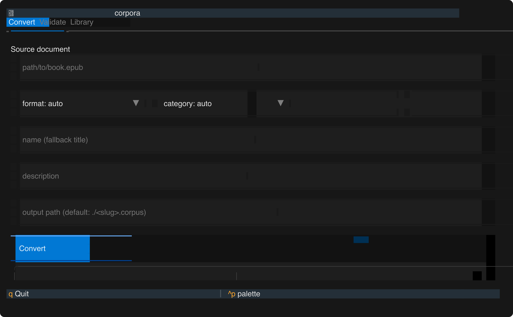
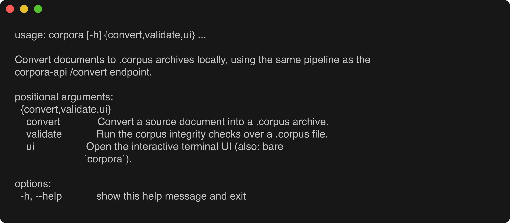
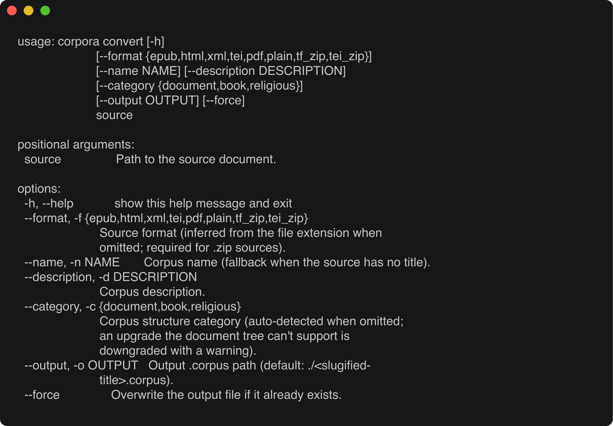

# exegia/corpora-cli

Homebrew tap for the [corpora-py](https://github.com/exegia/corpora-py)
toolchain — convert EPUBs, PDFs, HTML, TEI/XML, and plain text into queryable
`.corpus` archives from your terminal.

<p align="center">
  
</p>

## Install

The repo doesn't carry Homebrew's `homebrew-` name prefix, so tap it by URL
once, then install:

```bash
brew tap exegia/corpora-cli https://github.com/exegia/corpora-cli
brew install corpora
```

This installs corpora-py into its own virtualenv and links three commands:

| Command | What it does |
| --- | --- |
| `corpora` | Terminal conversion CLI + interactive TUI |
| `corpora-api` | Combined FastAPI app (MCP server at `/mcp` + conversion API at `/convert`) |
| `cf-mcp` | Standalone MCP server (stdio) for AI clients |

Verify the install:

```bash
corpora --help
```



## Usage

### `corpora convert` — document → `.corpus`

```bash
corpora convert book.epub --name "My Book" -o book.corpus
corpora convert dataset.zip --format tf_zip
corpora convert notes.txt          # format inferred from the extension
```

```text
usage: corpora convert [-h]
                       [--format {epub,html,xml,tei,pdf,plain,tf_zip,tei_zip}]
                       [--name NAME] [--description DESCRIPTION]
                       [--category {document,book,religious}]
                       [--output OUTPUT] [--force]
                       source
```

| Argument / option | Description |
| --- | --- |
| `source` | Path to the source document. |
| `-f`, `--format` | Source format: `epub`, `html`, `xml`, `tei`, `pdf`, `plain`, `tf_zip`, `tei_zip`. Inferred from the file extension when omitted; **required for `.zip` sources**. |
| `-n`, `--name` | Corpus name (fallback when the source has no title). |
| `-d`, `--description` | Corpus description. |
| `-c`, `--category` | Corpus structure category: `document`, `book`, or `religious`. Auto-detected when omitted; an upgrade the document tree can't support is downgraded with a warning. |
| `-o`, `--output` | Output `.corpus` path (default: `./<slugified-title>.corpus`). |
| `--force` | Overwrite the output file if it already exists. |
| `-h`, `--help` | Show help and exit. |



### `corpora validate` — integrity checks

```bash
corpora validate book.corpus
```

| Argument | Description |
| --- | --- |
| `corpus` | Path to a `.corpus` archive. |

Prints a verdict plus archive stats:


### `corpora ui` — interactive terminal UI

```bash
corpora ui   # or just: corpora
```

Running `corpora` with no arguments (or `corpora ui`) opens a full-screen
terminal UI with **Convert**, **Validate**, and **Library** tabs — the same
pipeline as the CLI, driven by forms instead of flags (see the screenshot at
the top). Press `q` to quit, `^p` for the command palette.

### `corpora-api` — HTTP API + MCP over HTTP

```bash
corpora-api   # serves http://127.0.0.1:8000
```

Boots the combined FastAPI app: the conversion API at `/convert` and the MCP
server mounted at `/mcp`.

### `cf-mcp` — MCP server for AI clients

`cf-mcp` speaks MCP over stdio, for use in an AI client's MCP configuration,
e.g. for Claude Desktop / Claude Code:

```json
{
  "mcpServers": {
    "corpora": { "command": "cf-mcp" }
  }
}
```

## Releases

The formula tracks corpora-py's release tags. On each tagged PyPI publish,
corpora-py's `publish.yml` fires this repo's
[`bump.yml`](.github/workflows/bump.yml) (`bump-formula` dispatch), which
rewrites `Formula/corpora.rb`'s url/version/sha256 from the tag tarball and
commits to `main` — the bump commit *is* the release of the formula. Manual
bumps: *Actions → Bump formula → Run workflow* with the version.

## The CLI package

Since the CLI moved out of corpora-py, this repo also hosts the `corpora`
command itself: a uv-managed Python package under
[`src/corpora_cli`](src/corpora_cli) that depends on the
[corpora-py](https://pypi.org/project/corpora-py/) distribution from PyPI for
the pipeline (parsers, Text-Fabric conversion, storage backends) and renders
it as a Rich-styled, scriptable CLI — `convert`, `validate`, and the
`library` subcommands (list/publish/download/delete/show). No TUI: output is
line-oriented, colour drops away when piped, and `NO_COLOR` is honoured.

```bash
uv sync            # resolve corpora-py + rich into .venv
uv run corpora --help
make pytest        # ruff + pytest over the package
```

The package version is dynamic from the repo's [`VERSION`](VERSION) file, so
the release lanes below version it. (The Homebrew formula still installs
corpora-py's published entry points; it flips to installing this package once
a release tag ships it.)

## Contributing / CI

Same branch model as corpora-py — see
[`.github/WORKFLOW.md`](.github/WORKFLOW.md): branches are `<type>/<slug>`
with PR titles `<type>: summary`, targeting `dev`; a daily promote moves work
through `next` and a versioned `release/vX.Y.Z` into `main`. (The lanes
version the tap infra; the corpora version the formula ships stays on
`main`'s bump commits.) Every CI step is a make target:

```bash
make ci        # brew style + audit + install + test + pytest (what the PR check runs)
make pr-guard  # BASE/HEAD/TITLE validation (what the guard job runs)
```

`guard` and `check` (macOS: a real `brew install` + `brew test` of the
formula) run on every PR via [`pr.yml`](.github/workflows/pr.yml).
